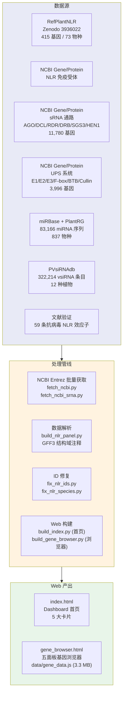

# 11. Antiviral Genes — 植物免疫与 sRNA 基因图谱

> 交互式基因浏览器，覆盖 NLR 免疫受体、sRNA 通路基因、UPS 泛素系统、miRNA 四大类别共 16,191 个基因。哈希导航五面板单页面应用。

**Live**: http://39.106.101.94/genes/

---

## 架构



---

## 数据量

| 类别 | 数量 | 来源 | 说明 |
|:-----|:----:|:-----|:-----|
| NLR 免疫受体 | 415 | RefPlantNLR | 73 物种, 含结构域注释 |
| sRNA 通路基因 | 11,780 | NCBI | AGO/DCL/RDR/DRB/SGS3/HEN1 |
| UPS 泛素系统基因 | 3,996 | NCBI | E1/E2/E3/F-box/BTB/Cullin/Proteasome |
| miRNA 序列 | 83,166 | miRBase + PlantRG + NCBI | 837 物种 |
| vsiRNA 记录 | 322,214 | PVsiRNAdb | 12 种植物, 33.6 MB |
| 抗病毒 NLR 效应子 | 59 | 文献验证 | 人工整理 |
| **合计** | **16,191** | — | 基因总数 |

---

## 页面结构

基因浏览器 (`gene_browser.html`) 使用 **哈希导航**，五面板单页面:

| Hash | 面板 | 内容 |
|:-----|:-----|:-----|
| `#nlr` | **NLR** | RefPlantNLR 表 (415) + 结构域架构图 + 抗病毒验证 (59) + 资源链接 |
| `#srna` | **sRNA** | AGO/DCL/RDR/DRB/SGS3/HEN1 基因表 + 结构域架构 |
| `#ups` | **UPS** | E1/E2/E3/F-box/BTB/Cullin/Proteasome 表 + 结构域架构 |
| `#mirna` | **miRNA** | miRNA 统计 + PVsiRNAdb vsiRNA 表 + 外部资源 |
| `#downloads` | **下载** | FASTA / TSV / JSON 文件按类别分组下载 |

### 交互特性

- **分页**: 所有表格 50 行/页, Prev/Next 导航
- **筛选**: 每面板物种/基因搜索 + 类型选择器
- **结构域可视化**: TIR/CC/NB-ARC/LRR/RPW8 域架构图
- **折叠区域**: 表格和资源列表可折叠/展开
- **NCBI 直链**: 直达 GenPept, NCBI Gene, CDD 搜索

---

## 管线步骤

### 1. 数据获取

```bash
python fetch_ncbi.py              # NLR 免疫受体 (NCBI Entrez)
python fetch_ncbi_srna.py          # sRNA 通路基因
# UPS 基因在构建脚本内通过 NCBI Entrez 批量获取
```

### 2. 数据处理

```bash
python build_nlr_panel.py          # RefPlantNLR Excel + GFF3 解析 → JSON
python fix_nlr_ids.py              # NLR 基因 ID 规范化 + 物种映射
python fix_nlr_species.py          # 物种名清理
python build_references.py         # → gene_references.json
python build_ups_references.py     # → ups_references.json
python scrape_pvsirnadb.py         # PVsiRNAdb 爬取 (Playwright) → 33.6 MB
python count_mirna.py              # miRNA 序列计数 + 种内去重 → 83K seqs
```

### 3. Web 生成

```bash
python build_index.py              # → index.html (5 大卡片首页)
python build_gene_browser.py       # → gene_browser.html + data/gene_data.js (3.3 MB)
```

---

## 数据文件

| 文件 | 大小 | 说明 |
|:-----|:-----|:-----|
| `all_genes_classified.json` | 3.2 MB | 全量分类基因数据 |
| `gene_data.js` | 3.3 MB | JS 变量 (供浏览器渲染) |
| `refplant_nlr_data.json` | 146 KB | 415 RefPlantNLR 基因 + 结构域 |
| `refplant_domains.json` | — | 每个基因 GFF3 结构域注释 |
| `antiviral_nlr_validated.json` | — | 59 条验证的抗病毒 NLR |
| `miRNA_all_combined.fa` | 4.9 MB | 合并 miRNA 序列 |
| `pvsirnadb_vsirna.tsv` | 33.6 MB | 每种病毒的 siRNA 记录 |
| `plant_UPS_proteins.fasta` | ~2 MB | 全部 UPS 蛋白序列 |
| `gene_references.json` | — | 验证参考文献 |
| `ups_references.json` | — | UPS 家族参考文献 |

---

## 文件结构

```
11.antiviral_genes/
├── build_index.py              # 首页构建 (index.html)
├── build_gene_browser.py       # 基因浏览器构建 (gene_browser.html)
├── build_nlr_panel.py          # RefPlantNLR 数据解析 + 结构域注释
├── fetch_ncbi.py               # NCBI Entrez 批量获取 (NLR)
├── fetch_ncbi_srna.py          # NCBI Entrez 批量获取 (sRNA)
├── build_references.py         # 参考文献验证数据
├── build_ups_references.py     # UPS 参考文献数据
├── fix_nlr_ids.py              # NLR ID 规范化 + 物种映射
├── fix_nlr_species.py          # 物种名清理
├── add_nlr_virus.py            # 病毒关联映射
├── scrape_pvsirnadb.py         # PVsiRNAdb 爬虫 (Playwright)
├── count_mirna.py              # miRNA 序列计数 + 去重
├── index.html                  # 生成的首页 → /genes/
├── gene_browser.html           # 生成的浏览器 → /genes/gene_browser.html
├── data/                       # 生成的数据文件 (90+)
│   ├── gene_data.js            # JS 变量 (NLR_DATA, SRNA_DATA 等)
│   ├── all_genes_classified.json  # 主分类基因数据
│   ├── refplant_nlr_data.json     # RefPlantNLR 415 基因
│   ├── refplant_domains.json      # 结构域注释
│   ├── antiviral_nlr_validated.json  # 59 条验证抗病毒 NLR
│   ├── gene_references.json       # 验证参考文献
│   ├── ups_references.json        # UPS 参考文献
│   ├── miRNA_*.fa / *.fasta       # miRNA 序列
│   ├── protein_*.fasta            # 蛋白 FASTA (sRNA/UPS/NLR)
│   ├── */*_genes.tsv              # 基因表 (sRNA/UPS/NLR)
│   ├── pvsirnadb_*.tsv            # PVsiRNAdb 爬取数据
│   ├── plantrg_*                  # PlantRG miRNA 数据
│   └── individual_queries/        # 单基因 NCBI 查询结果
└── archive/                    # 归档旧脚本
```

---

## 部署

| 项目 | 配置 |
|:-----|:-----|
| **类型** | 纯静态 (Nginx 直接服务) |
| **Nginx** | `/genes/` → alias `docs/genes/`, `expires 1h` |
| **服务器路径** | `/opt/plant_virus_db/plant_virus_db_pipeline/docs/genes/` |
| **部署方式** | 本地 build → paramiko SFTP 上传 |
