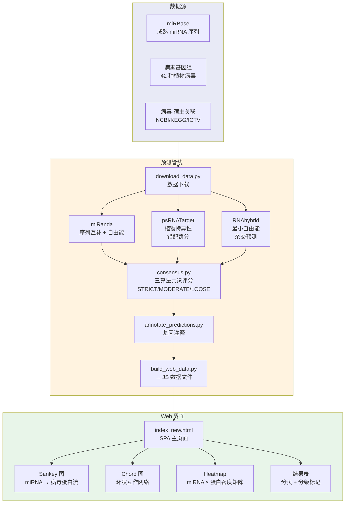

# 12. PV-miRNA — 植物抗病毒 miRNA 预测工作台

> 三算法共识 (miRanda + psRNATarget + RNAhybrid) 植物病毒 miRNA 靶标预测。交互式 Sankey/Chord/Heatmap 可视化。402 物种 × 42 病毒, 83,166 miRNA 索引。

**Live**: http://39.106.101.94/pamirdb/

> 原名: PAmiRDB — Plant Antiviral miRNA Prediction Database

---

## 架构



---

## 三算法共识

| 算法 | 方法 | 适用场景 |
|:-----|:-----|:---------|
| **miRanda** | 序列互补 + 自由能评分 | 通用 miRNA 靶标预测 |
| **psRNATarget** | 植物特异性错配罚分模型 | 植物 miRNA 靶标优化 |
| **RNAhybrid** | 最小自由能 (MFE) 杂交 | RNA-RNA 二级结构预测 |

### 共识分级

| 等级 | 标准 | 颜色 |
|:-----|:-----|:----:|
| **STRICT** | 3/3 算法一致, 强种子配对, 低 MFE | 🟢 绿色 |
| **MODERATE** | 2/3 算法一致, 中等种子配对 | 🟡 黄/橙 |
| **LOOSE** | 1/3 算法一致, 弱种子配对 | 🔴 红色 |

---

## 预测管线

```bash
# 1. 数据下载
python scripts/download_data.py         # miRBase + 病毒基因组

# 2. 三算法预测
python scripts/consensus.py             # 共识评分 (STRICT/MODERATE/LOOSE)
python scripts/annotate_predictions.py  # 基因注释

# 3. Web 数据生成
python scripts/build_web_data.py        # → data/web/*.js

# 4. 启动服务
python run.py                           # :8000
python run.py --pipeline                # 仅管线, 不启动服务
python run.py --all                     # 全流程 (管线 + 服务)
python run_v7.sh                        # v7 生产部署脚本
```

---

## Web 界面

SPA (`index_new.html`) 提供:

1. **物种/miRNA 选择**: 按分类科/属筛选, 选择单个 miRNA
2. **病毒靶标选择**: 选择目标病毒基因组或自定义序列
3. **算法配置**: 选择算法组合, 调整能量/种子阈值
4. **结果表**: 分页结果, 分级标记, 共识等级, 基因靶标
5. **可视化**:
   - **Sankey 图**: miRNA → 病毒蛋白流量 (共识颜色编码)
   - **Chord 图**: 环状 miRNA ↔ 病毒蛋白互作网络
   - **Heatmap**: miRNA × 病毒蛋白互作密度矩阵

---

## 数据统计

| 指标 | 数值 |
|:-----|:----:|
| 覆盖植物物种 | 402 |
| 覆盖病毒物种 | 42 |
| miRNA 索引 | 83,166 |
| v7 注释预测 | 1,706 |
| 数据库格式 | SQLite |

---

## 文件结构

```
12.pamirdb/
├── run.py                     # 管线启动器 (--pipeline / --all / --port)
├── run_v7.sh                  # v7 生产部署脚本
├── backend/                   # 后端
│   ├── server.py              # 生产 HTTP 服务 (:8000, /pamirdb/)
│   ├── server_deploy.py       # 替代部署服务
│   ├── index.html             # Database Browse 页面
│   ├── index_new.html         # Prediction Workbench 主 SPA
│   └── network.html           # 独立网络可视化
├── scripts/                   # 管线脚本 (53 文件)
│   ├── database.py            # SQLite schema + 查询
│   ├── download_data.py       # 数据获取 (miRBase, 病毒基因组)
│   ├── consensus.py           # 三算法共识评分
│   ├── annotate_predictions.py # 预测注释管线
│   ├── build_web_data.py      # 生成 JS 数据
│   ├── alignment.py           # miRNA-target 比对
│   ├── circos_network.py      # 环状网络图
│   ├── audit.py               # 预测质量审计
│   └── ...                    # 辅助脚本
├── data/                      # 数据
│   ├── pamirdb.sqlite         # 主数据库
│   ├── predictions.json       # 预测结果 (v7 注释)
│   ├── mirna/                 # miRNA 序列
│   ├── virus_genomes/         # 病毒基因组 FASTA
│   └── web/                   # Web 前端数据 (JS)
├── figures/                   # 生成图表
├── nginx_pamirdb.conf         # Nginx 配置
└── pam_nginx_snippet.conf     # 替代 Nginx 片段
```

---

## 版本历史

| 版本 | 关键变更 |
|:-----|:---------|
| v3 | 初始三算法管线 |
| v5 | 共识分级系统 |
| v7 | 注释预测 + Sankey/Chord/Heatmap 可视化 + 扩展物种覆盖 |

---

## 部署

| 项目 | 配置 |
|:-----|:-----|
| **systemd** | `pamirdb.service` → :8000 |
| **Nginx** | `/pamirdb/` → proxy_pass `http://127.0.0.1:8000/` |
| **服务入口** | `backend/server.py` (加载 `index_new.html` 为主页) |
| **缓存** | HTML 在服务启动时加载, 修改后需重启 |

### 本地开发

```bash
python run.py --port 8080
# → http://localhost:8080/
```

---

## 核心脚本速查

| 脚本 | 功能 |
|:-----|:-----|
| `scripts/database.py` | SQLite schema (species, mirnas, viruses, predictions, consensus) |
| `scripts/download_data.py` | 获取 miRBase mature.fa + 病毒基因组 |
| `scripts/consensus.py` | 合并 miRanda/psRNATarget/RNAhybrid 为分级评分 |
| `scripts/annotate_predictions.py` | 添加基因名和蛋白产物到预测记录 |
| `scripts/build_web_data.py` | 导出预测为 JS 变量供 Web 渲染 |
| `scripts/audit.py` | 预测质量验证检查 |
