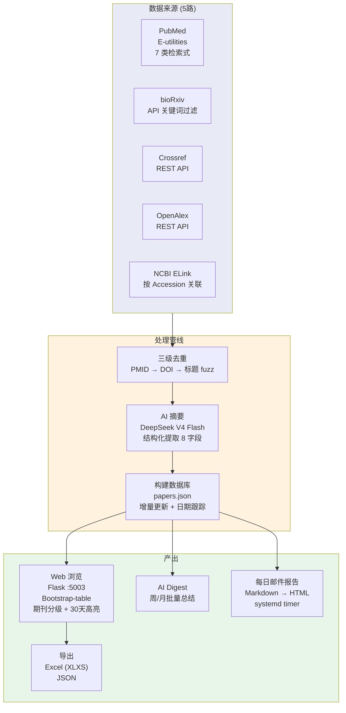

# 7. Literature Tracker — 植物病毒文献自动追踪系统

> 多源文献抓取 → AI 结构化摘要 → 每日邮件报告 → Flask Web 浏览。7 类 PubMed 检索策略 + 4 源补充 (bioRxiv/arXiv/Crossref/OpenAlex)。

**Live**: http://39.106.101.94/literature/

---

## 架构



---

## CI 自动化流程

```
systemd timer: literature-daily.timer
    │
    ├── 每日 08:00 UTC ──→ auto-paper-collecter/ (PubMed + Semantic Scholar)
    │                           │
    │                           ├── fetch_pubmed.py (7 类检索式)
    │                           ├── fetch_preprints.py (arXiv + bioRxiv)
    │                           └── fetch_linked_papers.py (accession 关联)
    │
    ├── dedup.py (PMID → DOI → 标题 fuzz 三级去重)
    │
    ├── digest.py (DeepSeek V4 Flash 逐篇生成 200 字中文摘要)
    │
    ├── build_data.py (合并 → papers.json, 增量更新)
    │
    └── paper-daily/ (Markdown → HTML 邮件, 发送至订阅列表)
```

---

## 数据量

| 指标 | 数值 |
|:-----|:----:|
| 精选文献总计 | 7,099 |
| 结构化记录 (AI 摘要) | 2,892 |
| PubMed PDF 全文 | 8.25 GB (gitignore) |
| 日/周/月报告 | cron 自动生成 |

---

## 检索源

| 源 | 方法 | API |
|:---|:-----|:-----|
| **PubMed** | NCBI E-utilities (esearch + efetch) | eutils.ncbi.nlm.nih.gov |
| **bioRxiv** | API 关键词过滤 | api.biorxiv.org |
| **Crossref** | REST API | api.crossref.org |
| **OpenAlex** | REST API (含摘要倒排索引重建) | api.openalex.org |

---

## 7 类 PubMed 检索策略

| 检索类别 | 聚焦方向 |
|:---------|:---------|
| **General** | 植物病毒综合文献 |
| **Geminiviridae** | 双生病毒科 |
| **Potyviridae** | 马铃薯Y病毒科 |
| **Tospoviridae** | 番茄斑萎病毒科 |
| **Closteroviridae** | 长线形病毒科 |
| **Bromoviridae** | 雀麦花叶病毒科 |
| **Virgaviridae** | 植物杆状病毒科 |

---

## AI 功能

### 论文 AI 摘要

点击 `AI` 按钮 → 发送 title + abstract 到 DeepSeek → 结构化提取 8 字段:

| 字段 | 内容 |
|:-----|:-----|
| 病毒 | 涉及的病毒种类 |
| 宿主 | 宿主植物 |
| 症状 | 病害症状描述 |
| 媒介 | 传播媒介 |
| 地点 | 研究/采样地点 |
| 方法 | 关键技术方法 |
| 结果 | 核心发现 |
| 讨论 | 主要结论与意义 |

### AI Digest

- 批量论文的周/月总结
- 趋势关键词提取
- 研究热点变迁追踪

### RAG 问答

- 知识库驱动的植物病毒学 Q&A
- 与 `6.knowledge_rag` 模块联动

---

## 文件结构

```
7.literature_tracker/
├── api_server.py              # Flask Web 服务 (:5003, /literature/)
├── config.py                  # 文献模块配置
├── build_data.py              # 构建 papers.json (合并 + 日期跟踪)
├── fetch_pubmed.py            # PubMed E-utilities 多策略检索
├── fetch_preprints.py         # arXiv/bioRxiv 预印本抓取
├── fetch_linked_papers.py     # NCBI ELink 按 accession 关联文献
├── fetch_species_papers.py    # 按物种名检索
├── digest.py                  # DeepSeek AI 摘要生成
├── dedup.py                   # 三级去重 (PMID/DOI/标题相似度)
├── download_pubmed.py         # PubMed PDF 批量下载
├── download_genbank.py        # GenBank 记录下载 (供注释构建)
├── build_annotation.py        # 本地 genome_annotations 注释
├── download_pmc_pdf.py        # PMC 全文 PDF 下载
├── pmc_fulltext.py            # PMC 全文文本提取
├── europepmc_v2.py            # Europe PMC API 检索
├── pipeline.py                # 全流程编排
├── build_rag.py               # RAG 知识库构建
├── summarize_papers.py        # 论文批量 AI 摘要
├── summarize_batch.py         # 分批摘要生成
├── summarize_by_category.py   # 按分类摘要
├── run_summarize_batches.py   # 批量摘要调度
├── update_cron.sh             # cron 更新脚本
├── literature-tracker.service # systemd 服务配置
├── web/                       # 文献 Web 前端 (Flask templates)
├── data/                      # 数据库 (Journals/MeSH/Categories)
├── scripts/                   # 辅助脚本
├── archive/                   # 归档旧脚本
└── historical/                # 历史备份
```

---

## 快速开始

```bash
# 全量抓取 + 去重 + 摘要 + 生成 papers.json
python build_data.py

# 仅抓取最近 7 天
python fetch_pubmed.py --days 7 --api-key YOUR_KEY

# 启动 Web 服务
python api_server.py          # :5003, 访问 /literature/
```

## 部署

| 项目 | 配置 |
|:-----|:-----|
| **systemd 服务** | `literature-tracker.service` → :5003 |
| **systemd 定时器** | `literature-daily.timer` (每日文献抓取) |
| **Nginx** | `/literature/` → proxy_pass :5003 |
| **papers.json** | 由 `build_data.py` 生成 (gitignore) |
| **AI 模型** | DeepSeek V4 Flash, API key 存 `/opt/plant_virus_db/.env` |
| **PDF 存储** | `pubmed_records/` (8.25 GB, gitignore) |

### 定时器管理

```bash
systemctl status literature-daily.timer    # 查看状态
systemctl start literature-daily.service   # 手动触发
journalctl -u literature-daily.service -n 50  # 最近日志
```
