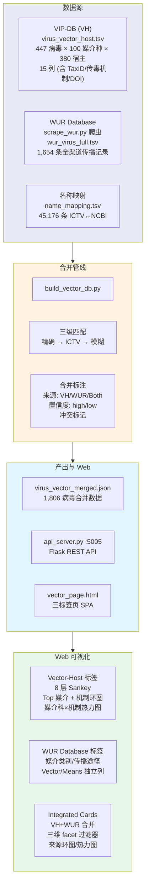
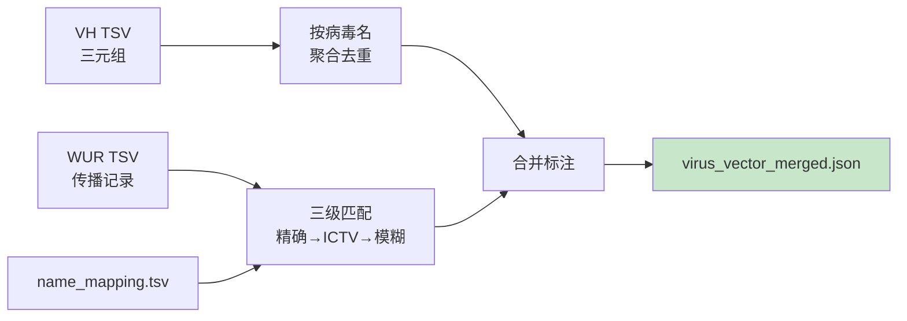

# 8. Plant-Insect — 病毒-媒介-宿主关系数据库

> 整合实验验证的 VH (病毒×媒介×宿主) 三元组 + WUR 全渠道传播记录，三维 facet 检索 + Sankey/Heatmap/Chord 可视化。

**Live**: http://39.106.101.94/vector/

---

## 架构



---

## 数据量

| 指标 | 数值 |
|:-----|:----:|
| 有媒介-宿主关系的病毒 | 1,806 |
| WUR 病毒传播记录 | 1,654 |
| 病毒-媒介-宿主三元组 | 1,375 |
| VH 病毒种 | 447 |
| VH 媒介种 | 100 |
| VH 宿主种 | 380 |

---

## 数据源

| 源 | 文件 | 说明 |
|:---|:-----|:-----|
| **VIP-DB (VH)** | `virus_vector_host.tsv` | 实验验证的三元组, 15 列 (含 TaxID/传毒机制/DOI/谱系) |
| **WUR** | `wur_virus_full.tsv` | 瓦赫宁根大学全渠道传播记录 (媒介类别/传播途径/参考文献) |
| **映射** | `docs/data/name_mapping.tsv` | ICTV/NCBI 名称双向映射 (45,176 条) |
| **合并输出** | `virus_vector_merged.json` | 预合并结果 (1,806 病毒), 供 Web 服务读取 |

---

## 合并管线 (`build_vector_db.py`)



**合并策略**:
1. VH 三元组按病毒 canonical name 聚合去重
2. WUR 通过 name_mapping 三级匹配 (精确 → ICTV → 模糊 review)
3. 标注 `sources`: `['VH']` | `['WUR']` | `['VH','WUR']`
4. 标注 `match_confidence`: `high` | `low`
5. 标注 `conflict_flags` (family 不一致时)
6. 衍生 `Vector or means of transmission` → 媒介拉丁名 + 传播方式拆分

---

## Web 界面 (三标签页)

### Vector-Host 标签页

| 组件 | 说明 |
|:-----|:-----|
| VH 原始表 | 15 列完整数据，排序/搜索 |
| **8 层 Sankey** | Virus Family → Genus → Species → Vector Family → Genus → Species → Mechanism → Host |
| Top 媒介种 | 柱状图排行 |
| 传毒机制环图 | Persistent/Non-Persistent/Semi-Persistent 分布 |
| 媒介科×机制热力图 | 二维交叉频率矩阵 |

### WUR Database 标签页

- 媒介类别 / 传播途径 / Vector / Means 独立列
- WUR 来源链接
- 图表面板 (类别分布 / 途径分布)

### Integrated Cards

- VH + WUR 合并卡片视图
- 三维 facet 过滤器 (带实时计数)
- 来源环图 / 媒介类别 / 传播途径 / 热力图
- 紧凑分页

---

## 文件结构

```
8.plant-insect/
├── api_server.py              # Flask Web 服务 (:5005, /vector/)
├── vector_page.html           # 前端 SPA (三标签页 + Plotly 图表)
├── build_vector_db.py         # 合并管线 (VH + WUR → virus_vector_merged.json)
├── scrape_wur.py              # WUR 网页爬虫 (结构化提取)
├── visualize_all.py           # 全量可视化脚本
├── virus_vector_host.tsv      # VH 数据 (15 列, 实验验证)
├── wur_virus_full.tsv         # WUR 数据 (gitignore)
├── wur_virus_data.tsv         # WUR 中间数据 (gitignore)
├── virus_vector_merged.json   # 合并产物 (gitignore)
├── vector-host.service        # systemd 服务配置
├── Fig1_overview.png          # 概览图
├── Fig2_heatmap.png           # 热力图
├── Fig3_transmission_family.png # 科级传播图
└── Supplementary Table 1.xlsx # 补充表 (gitignore)
```

---

## 快速开始

```bash
# 爬取 WUR 数据
python scrape_wur.py

# 重建合并
python build_vector_db.py

# 启动 Web 服务
python api_server.py           # :5005, 访问 /vector/
```

## 部署

| 项目 | 配置 |
|:-----|:-----|
| **systemd** | `vector-host.service` → :5005 |
| **Nginx** | `/vector/` → proxy_pass :5005 |
| **合并 JSON** | 由 `build_vector_db.py` 在服务器上运行生成 |
| **依赖** | Flask, Plotly (前端 CDN) |
