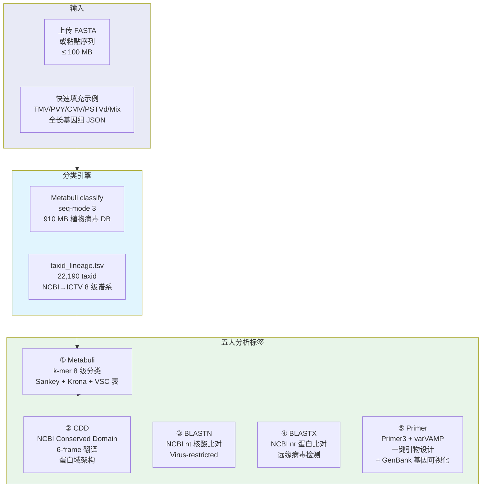
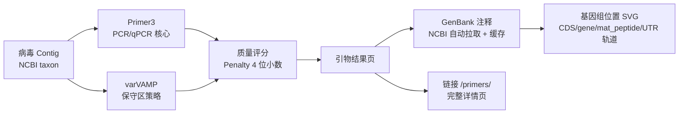
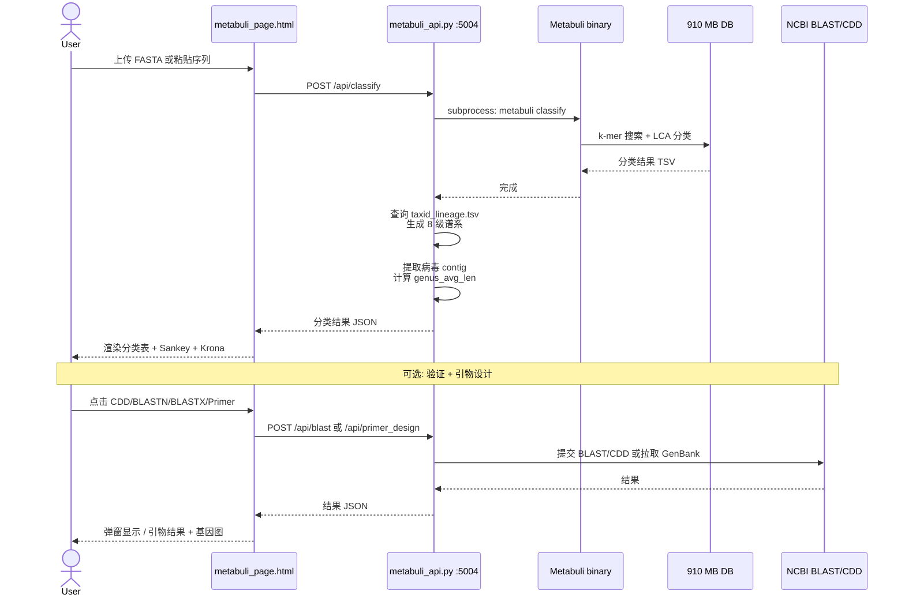

# 9. Metabuli — 植物病毒宏基因组分类器 Web

> 上传 contig 序列，基于 910 MB 植物病毒参考库进行 k-mer 分类。8 级 NCBI→ICTV 谱系注释。五大分析标签: Metabuli 分类 + CDD 保守域 + BLASTN/BLASTX 比对 + Primer 引物设计 + GenBank 基因可视化。

**Live**: http://39.106.101.94/metabuli/

---

## 架构



---

## 五大分析标签详解

### ① Metabuli — k-mer 分类

```
┌──────────────────────────────────────────────────────────┐
│  输入: FASTA contigs (≤100 MB)                           │
│                                                          │
│  Metabuli classify (seq-mode 3)                          │
│       ↓                                                  │
│  910 MB 植物病毒参考库                                   │
│       ↓                                                  │
│  8 级分类: Realm → Kingdom → Phylum → Class             │
│             → Order → Family → Genus → Species           │
│       ↓                                                  │
│  ┌─────────────────────────────────────────────────┐    │
│  │ 分类表 (每 contig 一行)                          │    │
│  │ Contig | Length | Realm..Species | Score | Flag │    │
│  └─────────────────────────────────────────────────┘    │
│  ┌──────────────────────────┐ ┌──────────────────────┐  │
│  │ Sankey 图 (前5种过滤)    │ │ Krona 图 (交互式)    │  │
│  └──────────────────────────┘ └──────────────────────┘  │
│  ┌─────────────────────────────────────────────────┐    │
│  │ 病毒 contig 表 (VSC)                             │    │
│  │ · 显示 ICTV 物种名 (NCBI→ICTV 自动转换)          │    │
│  │ · 近完整基因组高亮 (绿色)                        │    │
│  │ · 0.8 ≤ length/genus_avg ≤ 1.2 标注              │    │
│  │ · Analyze 列四件套: CDD / BLASTN / BLASTX / Primer│    │
│  └─────────────────────────────────────────────────┘    │
└──────────────────────────────────────────────────────────┘
```

### ② CDD — 保守域搜索

- 对选中的 contig 进行 6-frame 翻译
- 提交 NCBI CDD (Conserved Domain Database)
- 返回: 域名称、E-value、位置、描述
- 用途: 确认病毒蛋白域架构 (如 RdRp pfam00978)

### ③ BLASTN — 核酸比对

- 对选中的 contig 提交 NCBI BLASTN
- 数据库: NCBI nt (Virus-restricted)
- Top 50 hits, 含 accession/description/identity/coverage/e-value

### ④ BLASTX — 翻译蛋白比对

- 6-frame 翻译后对 NCBI nr 进行 BLASTX
- 数据库: NCBI nr (Virus-restricted)
- 远缘病毒检测: 蛋白比对灵敏度优于核酸

### ⑤ Primer — 引物设计 ✨ NEW (2026-07-23)



**功能亮点**:
- 对分类出的病毒 contig 一键设计 PCR/qPCR 引物
- **NCBI→ICTV 物种名转换**: 自动查物种索引显示规范名
- **质量评分**: Penalty 精度 4 位小数 (修复了之前全零的 bug)
- **基因组位置可视化**: 引物结合位点叠加在 GenBank 注释轨道上
- **GenBank 缓存**: 自动从 NCBI 拉取 .gb 文件并按 accession 缓存
- **跨模块联动**: 结果链接到 `/primers/` 引物数据库完整详情页

---

## 分类工作流



---

## 文件结构

```
9.metabuli/
├── metabuli_api.py            # Flask 服务 (:5004)
│                              #   - 异步 Metabuli 分类
│                              #   - BLASTN/BLASTX/CDD 提交 + 轮询
│                              #   - Primer 设计 (Primer3 + varVAMP)
│                              #   - GenBank 特征解析 (_fetch_gb, _extract_features)
│                              #   - taxid_lineage.tsv 内存缓存
│                              #   - Job 管理 (2h 自动清理)
├── metabuli_page.html         # 前端 SPA (~2200 行 JS)
│                              #   - 5 个分析标签页
│                              #   - Plotly Sankey + Krona iframe
│                              #   - 快速填充示例 + 上传进度
│                              #   - Primer 结果基因组位置 SVG
├── build_taxid_lineage.py     # 生成 taxid→ICTV 8 级谱系表
├── taxid_lineage.tsv          # 预生成映射 (22,190 taxid, gitignore)
├── fetch_examples.py          # NCBI efetch 生成示例
├── metabuli_examples.json     # TMV/PVY/CMV/PSTVd 全长基因组 JSON
├── metabuli-api.service       # systemd 服务配置
└── README.md
```

---

## 病毒 Contig 表 (VSC) 特性

```
┌──────────────────────────────────────────────────────────────┐
│ 病毒 Contig 分类结果                                         │
│ ┌──────────┬────────┬─────────┬──────┬──────────┬──────────┐│
│ │ Contig   │ Length │ Species │ Score│ 属均长   │ 完整性   ││
│ ├──────────┼────────┼─────────┼──────┼──────────┼──────────┤│
│ │ NODE_12  │ 9,247  │ Novel   │ 0.72 │ 10,200   │ 🟢 0.91x ││  ← 近完整
│ │ NODE_5   │ 6,395  │ TMV     │ 0.98 │ 6,400    │ 🟢 1.00x ││  ← 参考质量
│ │ NODE_33  │ 1,200  │ PVY     │ 0.85 │ 9,700    │   0.12x  ││  ← 片段
│ └──────────┴────────┴─────────┴──────┴──────────┴──────────┘│
│  🟢 绿色高亮 = 0.8 ≤ length/genus_avg ≤ 1.2                │
│  Analyze 列: [CDD] [BLASTN] [BLASTX] [Primer]              │
└──────────────────────────────────────────────────────────────┘
```

---

## 关键参数

| 参数 | 值 | 说明 |
|:-----|:---|:-----|
| Metabuli 模式 | seq-mode 3 | 适合 assembled contig |
| 参考库 | 910 MB | 由 `2.Build_plant_virus_db/build_virus_db.py` 构建 |
| 最大输入 | 100 MB | 可配置 `MAX_SIZE` |
| 分类耗时 | 3-5 分钟 | 典型输入大小 |
| 数据库 taxid | 22,190 | 覆盖 ICTV 全部病毒分类单元 |
| Job 保留时间 | 2 小时 | 自动清理 |
| BLAST/CDD 等待 | ≤ 5 分钟 | 轮询间隔 5s |
| GenBank 缓存 | 持久化 | 按 accession 存储 .gb 文件 |

---

## 快速开始

```bash
# 生成 taxid→ICTV 8 级谱系表 (一次性)
python build_taxid_lineage.py

# 生成演示示例
python fetch_examples.py

# 启动 Web 服务
python metabuli_api.py         # :5004
```

## 数据库依赖

| 文件 | 路径 | 来源 |
|:-----|:-----|:-----|
| Metabuli DB | `/opt/plant_virus_db/ref.virus.build.metabuli_db` | `2.Build_plant_virus_db/build_virus_db.py` |
| NCBI Taxonomy | `/opt/plant_virus_db/taxonomy/nodes.dmp` + `names.dmp` | NCBI FTP |
| Metabuli binary | `/usr/local/bin/metabuli` | 系统安装 |
| Primer3 | `primer_design_server/step2_design_primers.py` | `4.virus_primer/` 模块 |

---

## 部署

| 项目 | 配置 |
|:-----|:-----|
| **systemd** | `metabuli-api.service` → :5004 |
| **Nginx** | `/metabuli/` → :5004, `client_max_body_size 110m`, `proxy_read_timeout 600s` |
| **内存** | ~500 MB (分类进程 + taxlin 缓存) |
| **磁盘** | 910 MB (Metabuli DB) + ~50 MB (Job 临时文件) |
| **Python** | 3.10+, sys.path 需含 `/opt/plant_virus_db/primer_design_server` |

## 最近修复 (2026-07-23)

| 问题 | 修复 |
|:-----|:-----|
| i18n.js 语法错误 | 删除无效翻译条目 `'的': ''s'` |
| HTML JS 转义断裂 | `5\'\''->3\'\''` → `&#39;→3&#39;` |
| Primer Score 全零 | `round(penalty,2)` → `round(penalty,4)` |
| Primer Results 不显示 | `primer_status` 无 results → 自动 fetch `/primer_results` |
| 服务器磁盘满 (100%) | 清理 3.4G i18n 备份 + 240MB tar.gz |
